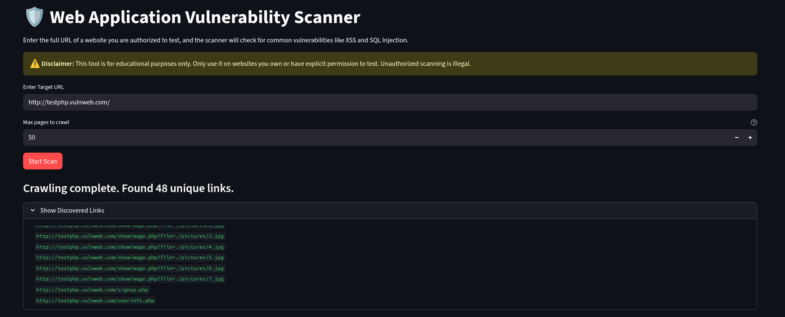
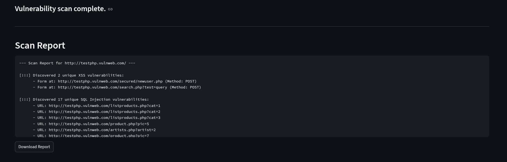

# 🛡️ Web Application Vulnerability Scanner

A Python-based tool designed to crawl a target website and scan for common security vulnerabilities, including Reflected Cross-Site Scripting (XSS) and error-based SQL Injection (SQLi). The project features a modular architecture, a professional command-line interface, and an interactive web application built with Streamlit.

## Demo




---

## 🚨 Ethical Use Disclaimer

**This tool is for educational purposes and authorized security testing only.** Never use this scanner on a website without explicit, written permission from the website owner. Unauthorized scanning of websites is illegal. The author is not responsible for any misuse or damage caused by this tool.

---

## Key Features

* **Recursive Web Crawler**: Discovers links within the target domain to map the application's structure.
* **Reflected XSS Scanner**: Detects vulnerabilities by submitting payloads to HTML forms and checking for unsafe reflections in the response.
* **Error-Based SQLi Scanner**: Identifies potential SQL injection vulnerabilities by injecting common SQL characters into URL parameters and analyzing the server's response for database errors.
* **Configurable & Professional CLI**:
    * Accepts a target URL and other options as command-line arguments.
    * Features a "verbose" mode (`-v`) for detailed crawling output.
    * Allows users to set a custom crawl depth (`--max-pages`).
    * Can save the final scan results to a report file (`-o`).
* **Interactive Web Interface**: A user-friendly web app built with Streamlit that provides an alternative to the command line for running scans.

---

## Technology Stack

* **Language**: Python 3
* **Core Libraries**:
    * `requests`: For making HTTP requests to the target website.
    * `BeautifulSoup4`: For parsing HTML to discover links and forms.
    * `Streamlit`: For the interactive web application.
    * `argparse`: For creating the professional command-line interface.

---

## Setup and Usage

### Prerequisites

* Python 3.10+

### 1. Clone the Repository

```bash
git clone https://github.com/DivGolakiya/WebAppScanner
cd WebAppScanner
```

### 2. Set Up the Environment
Create and activate a Python virtual environment:
```bash
python3 -m venv venv
source venv/bin/activate
```
Install the required dependencies:
```bash
pip install -r requirements.txt
```

### 3. Run the Application
You can run either the web application or the command-line tool.
**To run the Streamlit Web App:**
```bash
streamlit run app.py
```
**To run the Command-Line Interface (CLI):**
Provide the target URL as an argument.
```bash
# Basic scan
python main.py [http://testphp.vulnweb.com/](http://testphp.vulnweb.com/)

# Verbose scan with a custom page limit, saving the report
python main.py [http://testphp.vulnweb.com/](http://testphp.vulnweb.com/) -v --max-pages 100 -o report.txt
```
